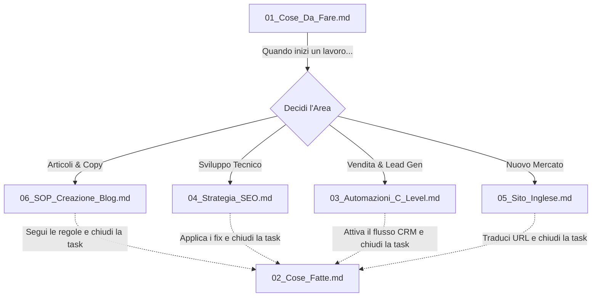

# 🗺️ Come Funziona Questa Documentazione (Mappa Operativa)

Questa cartella non è un semplice archivio di testo, ma un **sistema operativo interattivo**. 
In questo file ti spiego esattamente *come usare i vari documenti* e *come si collegano tra di loro* per poter scalare l'azienda.

## 🧭 Il Flusso di Lavoro (Come si muove il progetto)

Il sistema ragiona per "Task" collegate a "Istruzioni". 
Ecco il diagramma di flusso logico della documentazione Sintelops:

## 📖 Come navigare i Documenti

Possiamo dividere i file in due categorie precise: **I Tracker** e **I Motori**.

### 1. I "Tracker" (Gestione del Tempo e Tracciamento)
File che cambiano costantemente. Li apri ogni settimana per controllare l'andamento e orientarti.
- **`01_Cose_Da_Fare.md`**: È la tua *Lista della Spesa*. Se vuoi sapere quale priorità ha oggi il progetto Sintelops, aprilo.
- **`02_Cose_Fatte.md`**: È la tua *Cassaforte dello Storico*. **Regola:** Quando un pallino verde in "Cose Da Fare" viene spuntato, il testo non si cancella, ma lo si sposta taglia-incolla qua dentro. Questo crea una prova inconfutabile di tutto il lavoro svolto sul sito.

### 2. I "Motori" (Le Istruzioni e le Procedure)
Sono manuali operativi. Non si modificano quasi mai, si limitano a essere consultati quando "non sai come fare una cosa".
- **Il Copywriter** (o tu stesso) aprirà `06_SOP_Creazione_Blog.md` **ESCLUSIVAMENTE** quando riceve la direttiva di creare un nuovo articolo da "Cose Da Fare". Lì dentro troverà il template copia-e-incolla di codice.
- **Lo Sviluppatore Web** aprirà `04_Strategia_SEO.md` o `05_Sito_Inglese.md` quando dovrà lavorare sul codice, così saprà *esattamente* come Sintelops pretende i Metatag e la compressione, senza prendere iniziative di testa sua.
- **Il CRM Manager** aprirà `03_Automazioni_C_Level.md` quando ci sarà da connettere ActiveCampaign. Avrà tutte le direttive psicologiche sui Trigger temporali e sulle email da mandare al C-Level.

> [!IMPORTANT]
> **Riassunto della filosofia operativa:**
> Tutto parte da **[01_Cose_Da_Fare]**. Quando scegli un task lì dentro, ti "appoggi" a uno dei file di procedure (**da 03 a 06**) per capire come eseguirlo. A esecuzione finita, sposti l'elemento archiviandolo permanentemente in **[02_Cose_Fatte]**.
